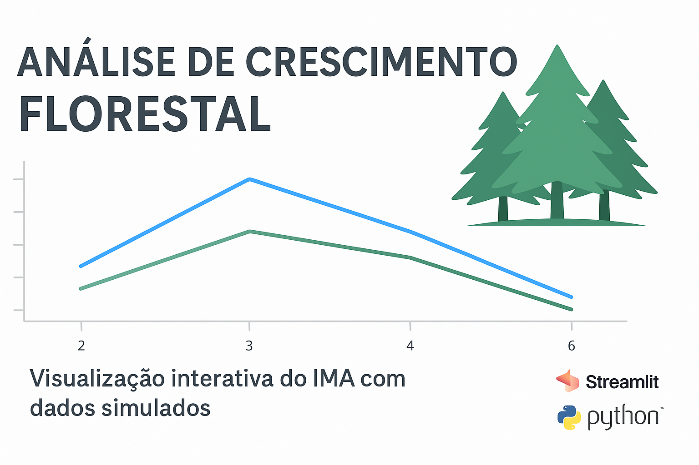

<p align="center">
  
</p>

# 🌲 Streamlit-Florestal-IMA

📉 **Analise descritiva e visualização interativa do Incremento Médio Anual (IMA) com dados simulados**

Este projeto utiliza a biblioteca Streamlit para criar uma aplicação web interativa que permite explorar dados simulados de crescimento florestal, comparando períodos históricos e atuais em diferentes genótipos, locais e idades.

---

## 📊 Demonstração:

🔗 Acesse o app online:  
👉 [app-florestal-ima.streamlit.app](https://app-florestal-ima-thiago-oliveira.streamlit.app/)


---

## ⚙️ Funcionalidades:
- Filtros interativos por **Idade**, **Genótipo** e **Fazenda**
- Calculo de Área total e IMA médio
- Tabelas de estatística descritiva por genótipo e fazenda
- Gráficos de distribuição do IMA e gráficos interativos com Ploty
- Comparação entre períodos **Histórico** e **Atual**


## 💻 Tecnologias:
- Python
- Streamlit
- Pandas
- Matplolib / Seaborn / Ploty
- Numpy
- openpyxl

---

## 🌳 Como executar esse projeto:

1. Clone este repositório:
```bash
git clone https://github.com/ThiagoWGdeOliveira/streamlit-florestal-ima.git
cd streamlit-florestal-ima
pip install -r requirements.txt
streamlit run app.py
```

# 🌱 Dados:

Os dados usados nesta aplicaçãoi foram simulados e não apresentam nenhuma base confidencial.


# 👨‍💻 Autor:
**Thiago Wendling Gonçalves de Oliveira**
[linkedln](https://www.linkedin.com/in/thiago-w-g-de-oliveira/) |
[🔗 Visualizar o App no Streamlit](https://app-florestal-ima-thiago-oliveira.streamlit.app/)

